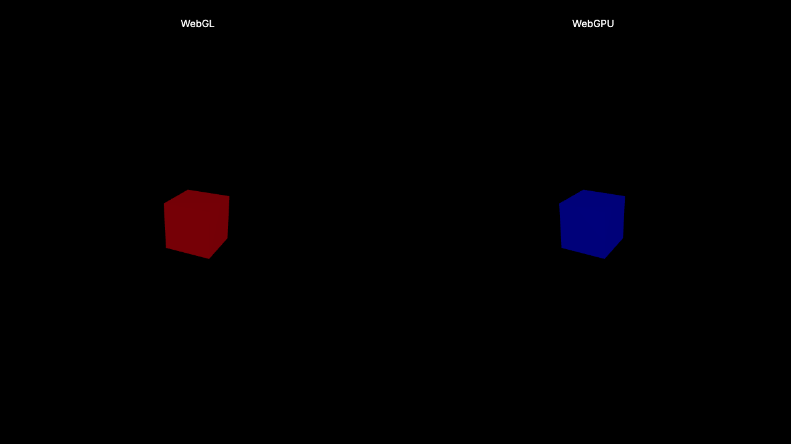

# three-visual-testing

A demonstration of Three.js visual regression testing with Playwright.



## Features

- 📸 Cross-platform screenshots
- 🌌 WebGL & WebGPU renderers

## Development

Install dependencies:

```bash
pnpm install
```

Run local development server:

```bash
pnpm dev
```

Open [localhost:4321](http://localhost:4321) in your browser.

## Testing

Types and linting:

```bash
pnpm test:types
pnpm test:lint
```

Building and testing end-to-end:

```bash
pnpm build
pnpm test:e2e
```

> [!WARNING]  
> The `pnpm test:e2e` example was made on macOS (Darwin), which means that the screenshot tests will fail for other operating systems due to low-level rendering differences between them. To update the snapshots for CI (Linux), run `pnpm test:e2e:docker`. After running it, you may also need to re-run `pnpm install` to continue working normally on the project.
>
> More details:
> - [Playwright docs / Continuous Integration / Containers](https://playwright.dev/docs/ci#via-containers)
> - [Playwright docs / Docker](https://playwright.dev/docs/docker)

## Determinism

When testing real scenes, it's important to make sure that they are deterministic static frames. Check out some approaches from the real-world example - [satelllte/kinect-stretch](https://github.com/satelllte/kinect-stretch):

### Entry point

https://github.com/satelllte/kinect-stretch/blob/main/src/pages/static.astro

https://github.com/satelllte/kinect-stretch/blob/main/src/components/Scene.tsx

> Passes `[isStatic=true]` property to the `Scene` component, which disables `OrbitControls` and also passes the props down to the rest of "dynamic" components.

### Post processing lock

https://github.com/satelllte/kinect-stretch/blob/main/src/components/PostProcessing.tsx

> When `[isStatic=true]`, it locks the randomization of the uniforms on "stretch pass" effect.

### Video texture lock

https://github.com/satelllte/kinect-stretch/blob/main/src/components/KinectPoints.tsx

> When `[isStatic=true]`, it doesn't play the video texture, and locks it on a single frame parametrized by `videoCurrentTime` query parameter (that can be passed directly from an end-to-end test).
